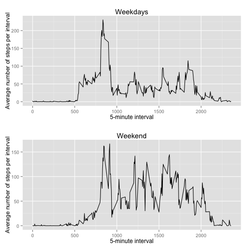

## Loading and preprocessing the data

First, the data is loaded from the file "activity.csv". Before loading the data, the correct working directory is set. The dates in the raw dataset are converted to Date variable type, and, finally, a list of unique dates is created.


```r
# read
setwd("~/work/courses/Reproducible/RepData_PeerAssessment1")
raw <- read.csv("activity.csv")

# replace date by as.Date(date))
raw$date <- as.Date(raw$date)

# create a list of unique dates
dates <- unique(raw$date)

# create a list of unique intervals
intervals <- unique(raw$interval)
```


## What is mean total number of steps taken per day?

In this code section the total number of steps for each day is computed.


```r
# compute the total number of steps for each day
steps_per_day <- data.frame(date=dates, steps=unlist(lapply(dates, function(x) {sum(raw$steps[raw$date==x], na.rm=TRUE)})))
```

Here is the histogram showing the number of steps per day: 

```r
# plot a histogram
library(ggplot2)
ggplot(steps_per_day, aes(x=date)) + geom_histogram(aes(y=steps), binwidth=1, stat="identity") + xlab("Day") + ylab("Number of steps per day")
```

 

Now the mean and the median number of steps are computed.

```r
# compute the total mean and median number of steps per day
mean_spd <- mean(steps_per_day$steps)
median_spd <- median(steps_per_day$steps)
```

The mean number of steps per day is 9354.2295, while the median number of steps is 10395.


## What is the average daily activity pattern?

First, the data is further processed to average number of steps for each 5-minute interval accross all days. The position of the interval which contains the maximum (average) number of steps is also computed.

```r
# average accross all days
steps_in_intervals <- data.frame(interval=intervals, steps=unlist(lapply(intervals, function(x) {mean(raw$steps[raw$interval == x], na.rm=TRUE)})))

# compute which interval contains the maximum number of sets (on average)
max_avg_interval <- steps_in_intervals$interval[which.max(steps_in_intervals$steps)]
```

Here is a time-series plot of the average number of steps per interval. The interval containing the maximum number of steps is indicated by a red vertical line.

```r
# make a time-series plot
ggplot(steps_in_intervals, aes(x=interval, y=steps)) + geom_line() + xlab("Interval start") + ylab("Average number of steps per interval") + geom_vline(xintercept = max_avg_interval, colour="red")
```

 

The maximum (on average) number of steps was observed during the interval 835.


## Imputing missing values

In this section the missing values in the dataset are dealt with. First, the total number of missing values is computed.


```r
num_NA <- sum(is.na(raw$steps))
```
There are in total 2304 missing values. Next, a new data frame is created where the missing values are filled from the global average for the corresponding interval. The data frame "steps_in_intervals" computed in previous section is used for filling.

```r
# create a mask for missing values
missing_mask <- is.na(raw$steps)

# process the data and replace each missing value by a (rounded) global average for its interval
fill_steps <- unlist(lapply(seq(1:length(missing_mask)), function(i) {if (missing_mask[i]) {as.integer(sum(steps_in_intervals$steps[intervals == raw$interval[i]]))} else {raw$steps[i]} }))

# create a new data frame
filled <- data.frame(date=raw$date, steps = fill_steps, interval = raw$interval)
```

Now the total number of steps for each day is computed.


```r
# compute the total number of steps for each day
fsteps_per_day <- data.frame(date=dates, steps=unlist(lapply(dates, function(x) {sum(filled$steps[raw$date==x])})))
```

The histogram showing the number of steps per day: 

```r
# plot a histogram
ggplot(fsteps_per_day, aes(x=date)) + geom_histogram(aes(y=steps), binwidth=1, stat="identity") + xlab("Day") + ylab("Number of steps per day")
```

 

Finally, the mean and the median number of steps are computed.

```r
# compute the total mean and median number of steps per day
fmean_spd <- mean(fsteps_per_day$steps)
fmedian_spd <- median(fsteps_per_day$steps)
```

The mean number of steps per day is 1.075 &times; 10<sup>4</sup>, while the median number of steps is 10641. Comparing with the results for the original data (mean = 9354.2295, median = 10395) we see that both have increased as a consequence of filling the missing values with the global average for their corresponding intervals. This means that the total daily number of steps is likely oversetimated. The following graph shows it, where the black lines shows the orignal data, and the red line shows the data when the missing values are filled.

```r
ggplot(data=steps_per_day, aes(x=date, y=steps)) + geom_line(aes(colour="original")) + geom_line(data=fsteps_per_day, aes(x=date, y=steps, colour="filled")) + scale_colour_manual(name="Data", values=c("original"="black", "filled"="red")) + xlab("Day") + ylab("Number of steps per day")
```

 

As can be seen, the red line is either overlapping or is above the black line, meaning that the number of steps per day is oversetimated.

## Are there differences in activity patterns between weekdays and weekends?

In order to answer the question it is necessary to plot the activity patterns for weekdays and weekend. First, the lists for weekdays and weekend are created, and then a new factor variable is added indicating whether the day of the observation is a weekday or not.


```r
# create the lists of days
weekday <- c("Monday", "Tuesday", "Wednesday", "Thursday", "Friday")
weekend <- c("Saturday", "Sunday")

# create a two-level factor variable
filled$isweekday <- as.factor(weekdays(raw$date) %in% weekday)
```

Next, two new data frames are created, one for the weekdays and one for the weekend. Both data frames contain the average number of steps per interval.

```r
# average accross all weekdays
steps_during_weekdays <- data.frame(interval=intervals, steps=unlist(lapply(intervals, function(x) {mean(filled$steps[(filled$interval == x) & filled$isweekday==TRUE], na.rm=TRUE)})))

# average accross all weekends
steps_during_weekends <- data.frame(interval=intervals, steps=unlist(lapply(intervals, function(x) {mean(filled$steps[(filled$interval == x) & filled$isweekday==FALSE], na.rm=TRUE)})))
```
Finally, the results are plotted in a two-panel figure.

```r
# load libraries
library(grid)
library(gridExtra)

# plot for weekdays and store in a variable
plot_weekdays <- ggplot(steps_during_weekdays, aes(x=interval, y=steps)) + geom_line() + xlab("5-minute interval") + ylab("Average number of steps per interval") + ggtitle("Weekdays")

# plot for weekends and store in a variable
plot_weekend <- ggplot(steps_during_weekends, aes(x=interval, y=steps)) + geom_line() + xlab("5-minute interval") + ylab("Average number of steps per interval") + ggtitle("Weekend")

# arrange plots in a 1x2 grid
grid.arrange(plot_weekdays, plot_weekend, ncol=1)
```

 

As we can see, there is indeed a difference in activity patterns between weekdays and weekend. During the weekdays the activity peaks in the morning, while during the weekend it is more evenly spread over the course of the day.
